# **Anleitung Partial-Credit Kodierung**

## Einführung

Diese Anleitung beschreibt die Anlage von **Partial-Credit-Kodierungen in Studio** anhand von Beispielaufgaben aus **Deutsch und Mathematik Primar**. Dabei werden die unterschiedlichen **Itemformate** und die jeweiligen Schritte zur Umsetzung im IQB-Studio ausführlich erläutert.

## **Übersicht**

+----------------+-------------------------------------------------------------------------------------------------------------------------------------------------------------------------+------------------------------------------------------------------------------------------------------------------------------------------------------------------------------------------------------------------------------------------------------------------------------+--------------------------------------------+
| **Fach**       | **Itemformat**                                                                                                                                                          | **PC-Prinzip**                                                                                                                                                                                                                                                               | **Bewertung**                              |
+================+=========================================================================================================================================================================+==============================================================================================================================================================================================================================================================================+============================================+
| **DeP**        | **Complex Multiple Choice**                                                                                                                                             | **Elementweise:** FC= 2 (Alle 5 Antworten korrekt); PC = 1 (4 von 5 Antworten korrekt); No Credit (0,1,2 oder 3 von 5 Antworten korrekt)                                                                                                                                     | **0-0-0-0-1-2**                            |
|                |                                                                                                                                                                         |                                                                                                                                                                                                                                                                              |                                            |
|                | 5 Zeilen x 2 Antwortoptionen                                                                                                                                            |                                                                                                                                                                                                                                                                              |                                            |
+----------------+-------------------------------------------------------------------------------------------------------------------------------------------------------------------------+------------------------------------------------------------------------------------------------------------------------------------------------------------------------------------------------------------------------------------------------------------------------------+--------------------------------------------+
| **DeP**        | **Complex Multiple Choice**                                                                                                                                             | **Elementweise:** FC= 2 (Alle 6 Antworten korrekt); PC = 1 (4 oder 5 von 6 Antworten korrekt); No Credit (0,1,2 oder 3 von 6 Antworten korrekt)                                                                                                                              | **0--0--0--0--1--1--2**                    |
|                |                                                                                                                                                                         |                                                                                                                                                                                                                                                                              |                                            |
|                | 6 (oder mehr) Zeilen x 2 Antwortoptionen                                                                                                                                |                                                                                                                                                                                                                                                                              |                                            |
+----------------+-------------------------------------------------------------------------------------------------------------------------------------------------------------------------+------------------------------------------------------------------------------------------------------------------------------------------------------------------------------------------------------------------------------------------------------------------------------+--------------------------------------------+
| **DeP**        | **Zuordnen -- V1**                                                                                                                                                      | **Zeilenweise:** Für jede korrekte Zuordnung 1 Credit: No Credit (0 von 4 Zuordnungen sind korrekt)                                                                                                                                                                          | **0--1--2--3--4**                          |
|                |                                                                                                                                                                         |                                                                                                                                                                                                                                                                              |                                            |
|                | 9 Elemente x 4 Ablegelisten (mehrere Elemente-pro Ablegeliste , mind. 1 Element bleibt übrig)                                                                           |                                                                                                                                                                                                                                                                              |                                            |
+----------------+-------------------------------------------------------------------------------------------------------------------------------------------------------------------------+------------------------------------------------------------------------------------------------------------------------------------------------------------------------------------------------------------------------------------------------------------------------------+--------------------------------------------+
| **DeP**        | **Zuordnen -- V2**                                                                                                                                                      | **Elementweise:** mit FC = 2 (Alle Antworten korrekt); PC = 1 (Alle Antworten -1 korrekt); No Credit (0,1,2 oder 3 von 5 Antworten korrekt)                                                                                                                                  | **0--0--0--0--1--2**                       |
|                |                                                                                                                                                                         |                                                                                                                                                                                                                                                                              |                                            |
|                | 6 Elemente x 5 Ablegelisten (mind. 1 Element bleibt übrig)                                                                                                              |                                                                                                                                                                                                                                                                              |                                            |
+----------------+-------------------------------------------------------------------------------------------------------------------------------------------------------------------------+------------------------------------------------------------------------------------------------------------------------------------------------------------------------------------------------------------------------------------------------------------------------------+--------------------------------------------+
| **DeP**        | **Verbale Kurzantwort -- V1**                                                                                                                                           | **Elementweise:** Für jede korrekte Eingabe erhält SuS 1 Credit; FC = 3 (Alle Antworten korrekt), PC = 2 (2 von 3 korrekt); PC = 1 (1 von 3 korrekt). No Credit für 0 von 3 korrekt.                                                                                         | **0--1--2--3**                             |
|                |                                                                                                                                                                         |                                                                                                                                                                                                                                                                              |                                            |
|                | 3 Eingabefeldern                                                                                                                                                        |                                                                                                                                                                                                                                                                              |                                            |
+----------------+-------------------------------------------------------------------------------------------------------------------------------------------------------------------------+------------------------------------------------------------------------------------------------------------------------------------------------------------------------------------------------------------------------------------------------------------------------------+--------------------------------------------+
| **DeP**        | **Verbale Kurzantwort -- V2**                                                                                                                                           | **Elementweise** Für jede korrekte Eingabe erhält SuS 1 Credit; FC = 2 (Alle Antworten korrekt), PC = 1 (1 von 2 korrekt oder 1 doppelt).                                                                                                                                    | **0--1--2**                                |
|                |                                                                                                                                                                         |                                                                                                                                                                                                                                                                              |                                            |
|                | 2 Eingabefelder (Einzigartigkeitsprüfung)                                                                                                                               |                                                                                                                                                                                                                                                                              |                                            |
+----------------+-------------------------------------------------------------------------------------------------------------------------------------------------------------------------+------------------------------------------------------------------------------------------------------------------------------------------------------------------------------------------------------------------------------------------------------------------------------+--------------------------------------------+
| **MaP**        | **Langantwort**                                                                                                                                                         | **Inhaltlich** Bei korrekter Antwort erhält SuS 2 Credits, bei teilweise-korrekter Antwort erhält SuS 1 Credit                                                                                                                                                               | **0--1--2**                                |
|                |                                                                                                                                                                         |                                                                                                                                                                                                                                                                              |                                            |
|                | 1 Eingabefeld                                                                                                                                                           |                                                                                                                                                                                                                                                                              |                                            |
+----------------+-------------------------------------------------------------------------------------------------------------------------------------------------------------------------+------------------------------------------------------------------------------------------------------------------------------------------------------------------------------------------------------------------------------------------------------------------------------+--------------------------------------------+
| **MaP**        | **MC und Langantwort**                                                                                                                                                  | **Inhaltlich** Bei korrekter MC-Auswahl UND korrekter Langantwort erhält SuS 2 Credits, bei korrekter MC-Auswahl UND teilweise-korrekter Langantwort erhält SuS 1 Credit. Bei falscher MC-Auswahl = No Credit. Bei korrekter MC-Auswahl UND falscher Langantwort = No Credit | **0-1-2**                                  |
+----------------+-------------------------------------------------------------------------------------------------------------------------------------------------------------------------+------------------------------------------------------------------------------------------------------------------------------------------------------------------------------------------------------------------------------------------------------------------------------+--------------------------------------------+
| **MaP**        | **Numerische Kurzantwort**                                                                                                                                              | **Elementweise:** FC= 2 (Alle Antworten korrekt) und PC = 1 (Alle Antworten -1 korrekt)                                                                                                                                                                                      | **0--0--1--2** (Hier: für 3 Eingabefelder) |
|                |                                                                                                                                                                         |                                                                                                                                                                                                                                                                              |                                            |
|                | Mind. 3 Eingabefelder                                                                                                                                                   |                                                                                                                                                                                                                                                                              |                                            |
+----------------+-------------------------------------------------------------------------------------------------------------------------------------------------------------------------+------------------------------------------------------------------------------------------------------------------------------------------------------------------------------------------------------------------------------------------------------------------------------+--------------------------------------------+
| **MaP**        | **Complex Multiple Choice**                                                                                                                                             | **Elementweise:** FC= 2 (Alle 5 Antworten korrekt); PC = 1 (4 von 5 Antworten korrekt); No Credit (0,1,2,3 von 5 Antworten korrekt)                                                                                                                                          | **0-0-0-0-1-2**                            |
|                |                                                                                                                                                                         |                                                                                                                                                                                                                                                                              |                                            |
|                | 5 Zeilen x 2 Antwortoptionen                                                                                                                                            |                                                                                                                                                                                                                                                                              |                                            |
+----------------+-------------------------------------------------------------------------------------------------------------------------------------------------------------------------+------------------------------------------------------------------------------------------------------------------------------------------------------------------------------------------------------------------------------------------------------------------------------+--------------------------------------------+
| **MaP**        | **Zuordnen -- V1**                                                                                                                                                      | **Elementweise** FC= 2 (Alle Antworten korrekt) und PC = 1 (Alle Antworten -1 korrekt)                                                                                                                                                                                       | **0--0--0--1--2**                          |
|                |                                                                                                                                                                         |                                                                                                                                                                                                                                                                              |                                            |
|                | Unendliche viele Elemente (Einstellung „Element kopieren") × 4 Ablegelisten (mind. 1 Element bleibt übrig)                                                              |                                                                                                                                                                                                                                                                              |                                            |
+----------------+-------------------------------------------------------------------------------------------------------------------------------------------------------------------------+------------------------------------------------------------------------------------------------------------------------------------------------------------------------------------------------------------------------------------------------------------------------------+--------------------------------------------+
| **MaP**        | **Zuordnen -- V2**                                                                                                                                                      | **Zeilenweise:** FC= 2 (Alle Antworten korrekt) und PC = 1 (Alle Antworten -1 korrekt)                                                                                                                                                                                       | **0--0--1--2**                             |
|                |                                                                                                                                                                         |                                                                                                                                                                                                                                                                              |                                            |
|                | Unendliche viele Elemente (Einstellung „Element kopieren") × 9 Ablegelisten; Zuordnungskombinationen, Reihenfolge der Elemente UND zeilenweise Einzigartigkeit relevant |                                                                                                                                                                                                                                                                              |                                            |
+----------------+-------------------------------------------------------------------------------------------------------------------------------------------------------------------------+------------------------------------------------------------------------------------------------------------------------------------------------------------------------------------------------------------------------------------------------------------------------------+--------------------------------------------+
| **DeS**        | **Breites Complex Multiple Choice**                                                                                                                                     | [**Elementweise FC =**]{.mark}                                                                                                                                                                                                                                               |                                            |
|                |                                                                                                                                                                         |                                                                                                                                                                                                                                                                              |                                            |
|                | 7 Zeilen x 4 Antwortoptionen                                                                                                                                            |                                                                                                                                                                                                                                                                              |                                            |
+----------------+-------------------------------------------------------------------------------------------------------------------------------------------------------------------------+------------------------------------------------------------------------------------------------------------------------------------------------------------------------------------------------------------------------------------------------------------------------------+--------------------------------------------+

FC = Full Credit

PC = Partial Credit

DeP = Deutsch Primar

MaP = Mathe Primar

DeS = Deutsch Sekundar

V1 = Variante 1

V2 = Variante 2

# 1. Deutsch Primar (DeP)

## 1.1 Complex Multiple Choice (CMC 5x2)

**Beispielaufgabe:** Prototypische Aufgabe „Bildergalerie"

**IQB-Studio-Link:** <https://iqb-studio.de/#/a/1329/149210/preview>

**Itemformat:** CMC mit 5 Zeilen x 2 Antwortoptionen

**Partial Credit Prinzip:** elementweise 0-1-2-3-4-5

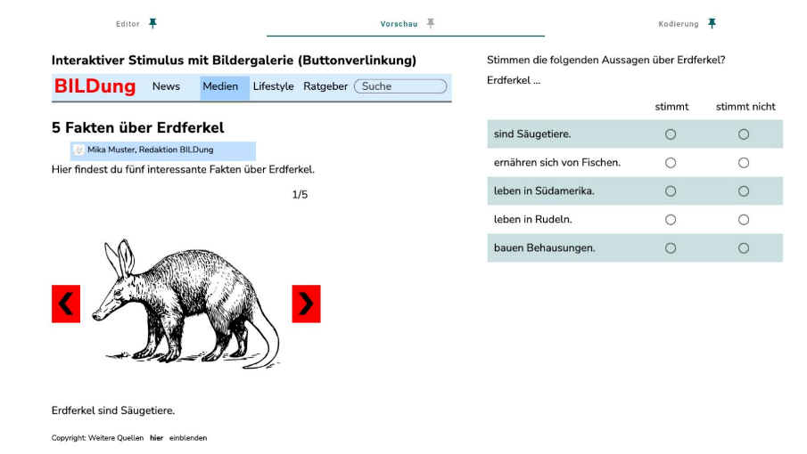{width="6.302083333333333in" height="2.3854166666666665in"}**Bewertung:** 0-0-0-0-1-2. (FC= 2 (Alle 5 Antworten korrekt); PC = 1 (4 von 5 Antworten korrekt); No Credit (0,1,2 oder 3 von 5 Antworten korrekt)

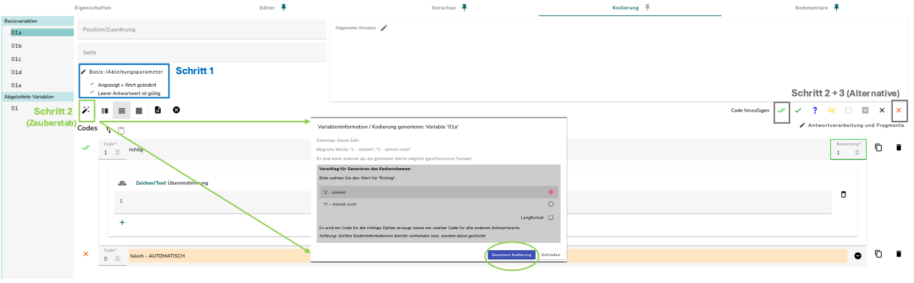{width="6.302083333333333in" height="1.9583333333333333in"}

**Geschlossene Kodierung der Basisvariablen 01a, 01b, 01c, 01d, 01e**

**Schritt 1:** *Basis-/Ableitungsparameter* anpassen (Häkchen bei "angezeigt = Wert geändert" und "leerer Antwortwert ist gültig")

**Schritt 2:** Mit Zauberstab die richtig Antwortoption (1 = „stimmt", 2 = „stimmt nicht") auswählen (s. Allgemeine Hinweise für Kodieranweisung).

Rotes Kreuz für „falsch-AUTOMATISCH wird mit Zauberstab automatisch hinzugefügt.

Diese Schritte für alle Basisvariablen wiederholen.

**Geschlossene Kodierung der Abgeleiteten Variable 01**

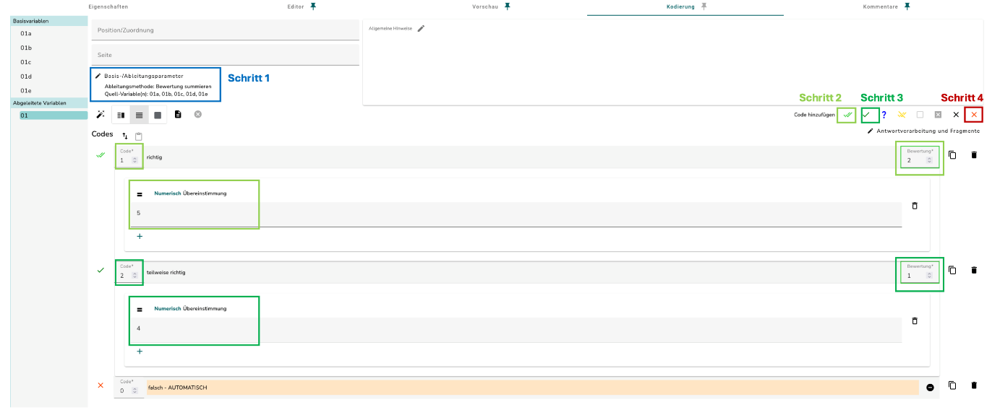{width="6.291666666666667in" height="2.6145833333333335in"}**Schritt 1**: *Basis-/ Ableitungsparameter* auswählen: Ableitungsmethode: Bewertung summieren. Quell-Variablen auswählen: 01a, 01b, 01c, 01d, 01e (alle Basisvariablen des Items)

**Schritt 2:** Richtig-Code (Doppelter grüner Haken) auswählen. Code 1 nennen. Bei Numerische Übereinstimmung maximale Basisvariablen-Anzahl eintragen (hier = 5). Oben rechts Bewertung = 2 auswählen.

- *Code 1: 5 von 5 Antworten korrekt (2 Credits)*

**Schritt 3:** Einen Teilweise-Richtig-Code (Ein grüner Haken) anlegen. Code 2. Bei *Numerische Übereinstimmung* entsprechend korrekte Anzahl an Antworten für PC Schema eintragen (Hier = 4). Oben rechts Bewertung auswählen (Hier = 1)

- *Code 2:* 4 von 5 Antworten korrekt (1 Credit)

**Schritt 4:** Rotes Kreuz „falsch-AUTOMATISCH" auswählen. Dieser Falsch-Code wertet alle Antworten mit 0, wenn keine, eine, zwei oder drei CMC-Option(en) korrekt ist/sind.

- *Falsch Code:* 0 oder 1, 2 oder 3 korrekte Antwort(en) (0 Credits)

## **1.2. Complex Multiple Choice (CMC 6x2)**

**Beispielaufgabe:** Prototypische Aufgabe „CMC_6x2"

**IQB-Studio-Link:** [https://iqb-studio.de/#/a/1329/149325/preview](https://iqb-studio.de/%23/a/1329/149325/preview)

**Itemformat:** CMC mit 6 Zeilen x 2 Antwortoptionen

**Partial Credit Prinzip:** elementweise 0-1-2-3-4-5-6

**Bewertung:** 0-0-0-0-1-1-2. (FC= 2 (Alle 6 Antworten korrekt); PC = 1 (4 oder 5 von 6 Antworten korrekt); No Credit (0,1,2 oder 3 von 6 Antworten korrekt)

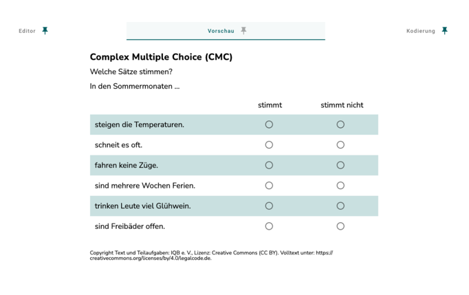{width="6.3in" height="1.9513888888888888in"}

**Geschlossene Kodierung der Basisvariablen 01a, 01b, 01c, 01d, 01e, 01f**

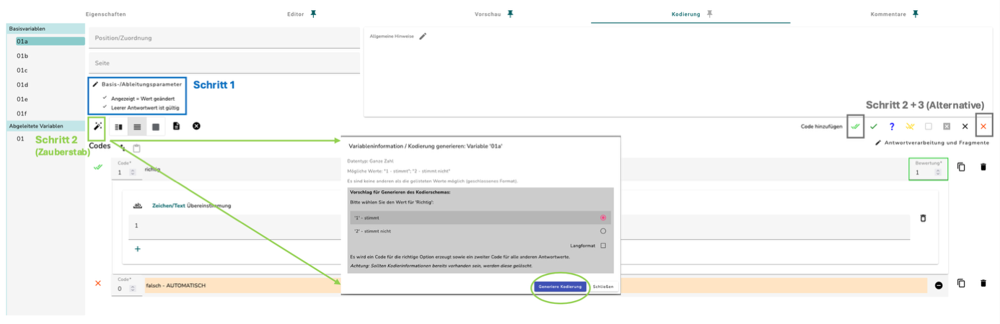{width="6.3in" height="2.0458333333333334in"}

**Schritt 1:** *Basis-/Ableitungsparameter* anpassen (Häkchen bei "angezeigt = Wert geändert" und "leerer Antwortwert ist gültig")

**Schritt 2:** Mit Zauberstab die richtig Antwortoption (1 = „stimmt", 2 = „stimmt nicht") auswählen (s. Allgemeine Hinweise für Kodieranweisung)

Rotes Kreuz für „falsch-AUTOMATISCH wird mit Zauberstab automatisch hinzugefügt.

Diese Schritte für alle Basisvariablen wiederholen.

**Geschlossene Kodierung der Abgeleiteten Variable 01**

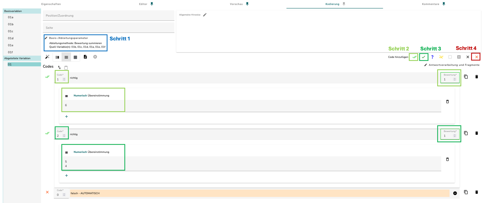{width="6.3in" height="2.6333333333333333in"}

**Schritt 1**: *Basis-/ Ableitungsparameter* auswählen: Ableitungsmethode: Bewertung summieren. Quell-Variablen auswählen: 01a, 01b, 01c, 01d, 01e (alle Basisvariablen des Items)

**Schritt 2:** Richtig-Code (Doppelter grüner Haken) auswählen. Code 1 nennen. Bei Numerische Übereinstimmung maximale Basisvariablen-Anzahl eintragen (hier = 6). Oben rechts Bewertung = 2 auswählen.

- *Code 1:* 6 von 6 Antworten korrekt (2 Credits)

**Schritt 3:** Einen Teilweise-Richtig-Code (Ein grüner Haken) anlegen. Code 2. Bei *Numerische Übereinstimmung* entsprechend korrekte Anzahl an Antworten für PC Schema eintragen (Hier = 4 und 5). Oben rechts Bewertung auswählen (Hier = 1)

- *Code 2:* 4 oder 5 Antworten korrekt (1 Credit)

**Schritt 4:** Rotes Kreuz „falsch-AUTOMATISCH" auswählen. Dieser Falsch-Code wertet alle Antworten mit 0, wenn keine, eine, zwei oder drei CMC-Option(en) korrekt ist/sind.

- *Falsch Code:* 0 oder 1, 2 oder 3 korrekte Antwort(en). Bewertung = 0.

## **1.3. Zuordnen (Variante 1)**

**Anmerkung:** mehrere Elemente-pro Ablegeliste mind. 1 Element bleibt übrig

**Beispielaufgabe:** Prototypische Aufgabe „Internetseite" Item 03

**IQB-Studio-Link:** <https://iqb-studio.de/#/a/1329/149211/preview>

**Itemformat:** Zuordnen mit 9 Elementen x 4 Ablegelisten

**Partial Credit Prinzip:** zeilenweise 0-1-2-3-4

**Bewertung:** 0-1-2-3-4 (1 Punkt pro Ablegeliste (03a, 03b, 03c, 03d) und Elementkombination vergeben, also Gesamtbewertung = 4; No Credit wenn 0 von 4 Zeilen korrekt zugeordnet wurden)

{width="6.3in" height="3.5520833333333335in"}

**Geschlossene Kodierung der Basisvariablen 03a, 03b, 03c, 03d**

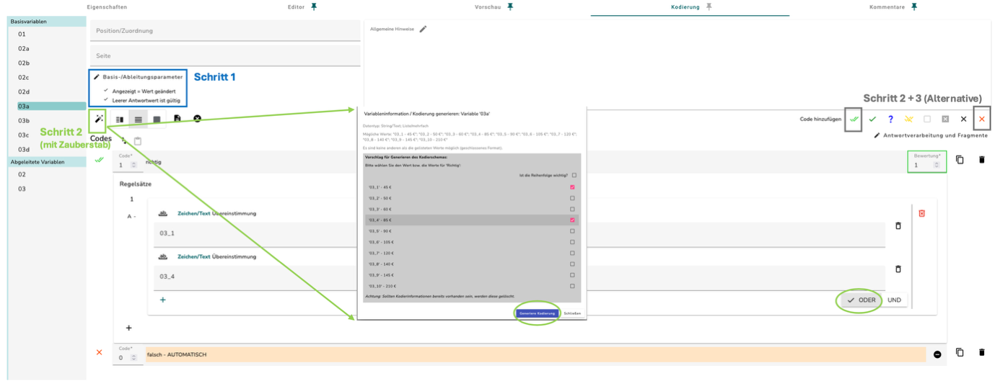{width="6.3in" height="2.404166666666667in"}

**Schritt 1:** *Basis-/Ableitungsparameter* anpassen (Häkchen bei "angezeigt = Wert geändert" und "leerer Antwortwert ist gültig")

**Schritt 2:** Mit Zauberstab die richtigen Elemente auswählen (Hier 03_1 und 03_4; s. Allgemeine Hinweise für Kodieranweisung).

Rotes Kreuz für „falsch-AUTOMATISCH wird mit Zauberstab automatisch hinzugefügt.

Diese Schritte für alle Basisvariablen wiederholen.

**Alternative Kodierung ohne Zauberstab:**

**Schritt 2:** Richtig-Code (Doppelter grüner Haken) anlegen. Code 1 nennen. Bei *Zeichen/Text Übereinstimmung* die passenden Elemente in einzelnen Regelsätzen (Hier 03_1 und 03_4) eintragen (Für Elementbezeichnung s. Editor, für Kodieranweisung s. Allgemeine Hinweise).

**Schritt 3:** Rotes Kreuz "falsch - AUTOMATISCH" für alle falschen Antworten auswählen.

**Geschlossene Kodierung der Abgeleiteten Variable 03**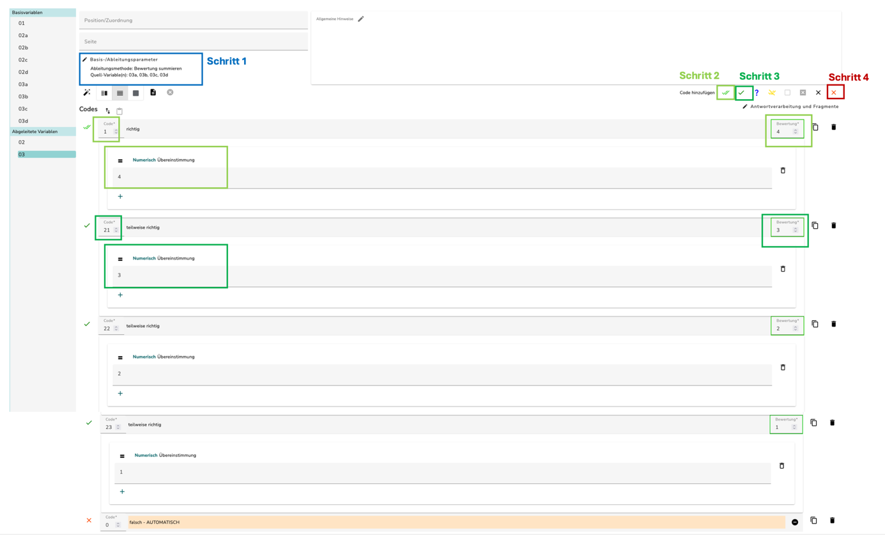{width="6.3in" height="3.80625in"}

**Schritt 1:** Ableitungsmethode auswählen: Bewertung summieren + Basisvariablen auswählen

**Schritt 2:** Richtig-Code (Doppelter grüner Haken) auswählen. Code 1 benennen. Bei "*Regel ändern*" *Numerische Übereinstimmung* auswählen. Anzahl der korrekten Antworten für diesen Bewertungsfall eintragen (hier 4). Bewertung oben rechts auswählen (hier Bewertung = 4).

- *Code 1:* 4 von 4 Antworten korrekt (4 Credits)

**Schritt 3:** Für die PC-Codes den teilweise-richtig-Code (Ein grüner Haken) auswählen. Bezeichnungen der PC-Codes zu 21, 22, 23 etc. ändern. Bei "*Regel ändern*" *Numerische Übereinstimmung* auswählen + Anzahl der korrekten Antworten für diesen PC-Credit-Fall eintragen (hier 3 absteigend). Bewertung oben rechts anpassen (hier = 3 absteigend).

- *Code 21: 3 von 4 korrekt (3 Credits)*

- *Code 22: 2 von 4 korrekt (2 Credits)*

- *Code 23: 1 von 4 korrekt (1 Credit)*

**Schritt 4:** Rotes Kreuz für "falsch- AUTOMATISCH" auswählen, um alle anderen Antworten als automatisch falsch abzufangen.

- *Falsch Code: Keine Antwort korrekt (0 Credits)*

## **1.4. Zuordnen (Variante 2)**

**Anmerkung:** 1 Element pro Ablegeliste; mind. 1 Element bleibt übrig

**Beispielaufgabe:** Partial Credit Dummy „DnD_Bild_Text"

**IQB-Studio-Link:** <https://iqb-studio.de/#/a/1329/149220/preview>

**Itemformat:** Zuordnen mit 6 Elementen x 5 Ablegelisten

**Partial Credit Prinzip:** elementweise 0-1-2-3-4-5

**Bewertung:** 0-0-0-0-1-2 (Bei Übereinstimmung = 5 gibt es 2 Punkte, bei Überstimmung = 4 gibt es 1 Punkt und alles andere ergibt 0 Punkte.)

{width="6.3in" height="3.120833333333333in"}

**Geschlossene Kodierung der Basisvariablen 01a, 01b, 01c, 01d, 01e**

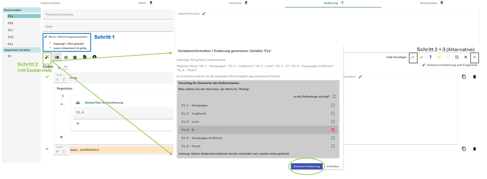{width="6.3in" height="2.328472222222222in"}

**Schritt 1:** *Basis-/Ableitungsparameter* anpassen (Häkchen bei "angezeigt = Wert geändert" und "leerer Antwortwert ist gültig")

**Schritt 2:** Mit Zauberstab die korrektes Element auswählen (Hier 01_4; s. Allgemeine Hinweise für Kodieranweisung).

Rotes Kreuz für „falsch-AUTOMATISCH wird mit Zauberstab automatisch hinzugefügt.

Diese Schritte für alle Basisvariablen wiederholen.

**Alternative Kodierung ohne Zauberstab:**

**Schritt 2:** Richtig-Code (Doppelter grüner Haken) auswählen. Code 1 nennen. Jeweils korrektes Element in Übereinstimmung eintragen (Für Elementbezeichnung siehe Editor, für Kodieranweisung s. Allgemeine Hinweise). Dieser Schritt kann auch mit dem Zauberstab durchgeführt werden.

**Schritt 3:** Rotes Kreuz "falsch - AUTOMATISCH" für alle falschen Antworten auswählen.

**Geschlossene Kodierung in der abgeleiteten Variable**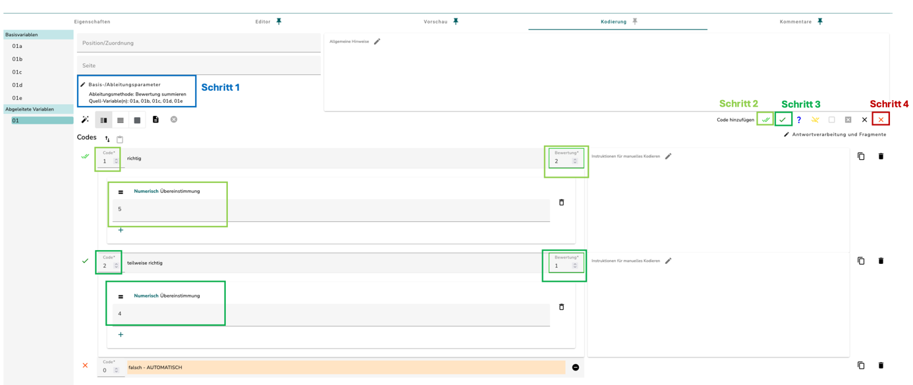{width="6.3in" height="2.661111111111111in"}

**Schritt 1:** Ableitungsmethode auswählen: Bewertung summieren + alle Basisvariablen auswählen 01a, 01b, 01c, 01d, 01e

**Schritt 2:** Richtig-Code (Doppelter grüner Haken) auswählen. Code 1 benennen. Bei Numerische Übereinstimmung maximale Anzahl korrekter Antworten eintragen (Hier Summenscore = 5). Bewertung = 2 als Full Credit auswählen.

- *Code 1:* 5 von 5 Antworten korrekt (2 Credits)

**Schritt 3:** Teilweise-Richtig-Code (Ein Grüner Haken) auswählen. Code 2 benennen. Numerische Übereinstimmung mit maximaler Anzahl korrekter Antworten -- 1 eintragen (Hier = 4). Bewertung = 1 Credit auswählen.

- *Code 2:* 4 von 5 Antworten korrekt (1 Credit)

**Schritt 4:** Rotes Kreuz „falsch-AUTOMATISCH" auswählen. Falsch Code bei 0,1,2,3 Antworten sind korrekt (0 Credits).

## **1.5. Verbale Kurzantwort (Variante 1)**

**Anmerkung:** 3 Eingabefelder

**Beispielaufgabe:** Prototypische Aufgabe „Lückentext_ST"

**IQB-Studio-Link:** <https://iqb-studio.de/#/a/1329/149221/preview>

**Itemformat:** Kurzantwort mit 3 Eingabenfelder

**Partial Credit Prinzip:** elementweise 0-1-2-3

**Bewertung:** 0-1-2-3 (Für jede korrekte Eingabe erhält SuS 1 Credit; FC = 3 (Alle Antworten korrekt), PC = 2 (2 von 3 korrekt); PC = 1 (1 von 3 korrekt); No Credit für 0 von 3 korrekt.)

**Geschlossene Kodierung der Basisvariablen 01a,01b,01c**

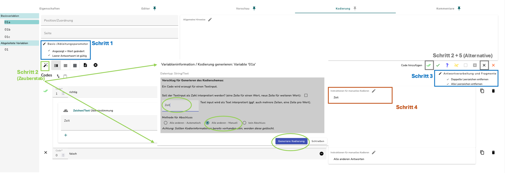{width="6.3in" height="2.161111111111111in"}

**Schritt 1:** *Basis-/Ableitungsparameter* anpassen (Häkchen bei "angezeigt = Wert geändert" und "leerer Antwortwert ist gültig")

**Schritt 2:** Mit Zauberstab Lösungswort in das Textfeld eintragen. Bei *Methode für Abschluss* „Alle anderen -- Manuell" auswählen. *Kodierung Generieren* auswählen.

**Schritt 3:** Bei Antwortverarbeitung und Fragmente „Alle Leerzeichen entfernen" und „Groß- und Kleinschreibung ignorieren" auswählen.

**Schritt 4:** Bei *Instruktion für manuelles Kodieren*, korrektes Lösungswort eintragen.

Jeder Schritt wird für jede Basisvariable mit passendem Lösungswort (s. Allgemeine Hinweise) wiederholt.

**Alternative Kodierung ohne Zauberstab:**

**Schritt 2:** Richtig-Code (Doppelter grüner Haken). Code 1 nennen. Lösungswort-Optionen bei „Zeichen/Text Übereinstimmung" eintragen. Bewertung = 1 auswählen.

**Schritt 5:** Schwarzes Kreuz „falsch" auswählen. Dieser Code dient der Möglichkeit zur Manuellen Kodierung (Falsche Antworten können im Nachhinein noch manuell geprüft werden.)

**Geschlossene Kodierung der Abgeleiteten Variable 01**

{width="6.3in" height="3.417361111111111in"}

**Schritt 1:** Ableitungsmethode: Bewertung summieren auswählen. Quell-Variablen 01a,01b,01c auswählen.

**Schritt 2:** Richtig-Code (Doppelter grüner Haken) auswählen. Code 1 nennen. Numerische Übereinstimmung = 3 eintragen (wenn alle 3 Basisvariablen korrekt sind, erhält SuS 3 Full Credit). Oben rechts Bewertung = 3 auswählen.

- *Code 1:* 3 von 3 Antworten korrekt (3 Credits)

**Schritt 3:** Teilweise-Richtig-Code (Ein grüner Haken) 2xl auswählen. In Code 21 und Code 22 benennen. Bei „Numerische Übereinstimmung" absteigend = 2, 1 eintragen. Oben rechts bei Bewertung entsprechenden Wert auswählen. (Wenn also 2 von 3 Antworten korrekt sind, erhält SuS 2 Credits; wenn 1 von 3 Antworten korrekt ist, erhält SuS 1 Credit)

- *Code 21:* 2 von 3 Antworten korrekt (2 Credit)

- *Code 21:* 1 von 3 Antwort korrekt (1 Credit)

**Schritt 4:** Rotes Kreuz „falsch-AUTOMATISCH" auswählen (Wenn 0 von 3 Antworten korrekt sind, erhält SuS 0 Credits).

## **1.6. Verbale Kurzantwort (Variante 2)**

**Anmerkung:** Reihenfolge der Antworten beliebig, Prüfung auf Einzigartigkeit!

**Beispielaufgabe:** Partial Credit Dummy „DeP_VerbaleKurzantwort"

**IQB-Studio-Link:** <https://iqb-studio.de/#/a/1329/149930/preview>

**Itemformat:** Kurzantwort mit 2 Eingabefeldern (Reihenfolge beliebig)

**Partial Credit Prinzip:** elementweise 0-1-2

**Bewertung:** 0-1-2 (1 Credit pro Eingabefeld; Für jede korrekte Eingabe erhält SuS 1 Credit; FC = 2 (Alle Antworten korrekt), PC = 1 (1 von 2 korrekt oder 1 doppelt))

***ACHTUNG:*** Die Kodierung hier ist etwas komplexer, da auf Einzigartigkeit geprüft wird{width="6.3in" height="0.9402777777777778in"}

**Geschlossene Kodierung für Basisvariablen 01a, 01b**

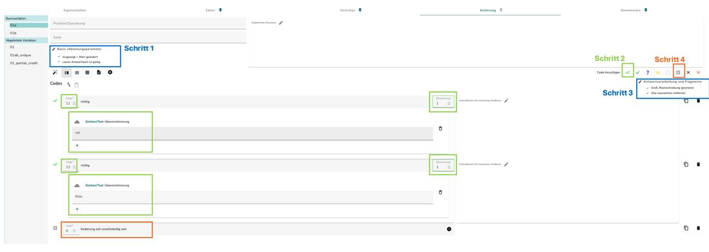{width="6.3in" height="2.2368055555555557in"}

Hier wird definiert, dass in beiden Elementen sowohl Antwort „rot" als auch Antwort „blau" korrekt sein kann.

**Schritt 1:** *Basis-/Ableitungsparameter* anpassen (Häkchen bei "angezeigt = Wert geändert" und "leerer Antwortwert ist gültig")

**Schritt 2:** Zwei Richtig-Codes auswählen (doppelter grüner Haken). In Code 11 und Code 12 benennen. Bei Code 11 *Zeichen/ Text Übereinstimmung* = „rot" eintragen, bei Code 12 *Zeichen/ Text Übereinstimmung* = „blau" eintragen. Oben rechts Bewertung = 1 jeweils auswählen.

**Schritt 3:** Wenn es sich um ein Textantworten handelt: Bei *Antwortverarbeitung und Fragmente* „Alle Leerzeichen entfernen" und „Groß- und Kleinschreibung ignorieren" auswählen.

**Schritt 4:** [Graues]{.underline} Kreuz „Kodierung soll unvollständig sein" auswählen.

Diese Schritte für Basisvariable 01a und 01b wiederholen.

**Geschlossene Kodierung für Abgeleitete Variable 01ab_unique** 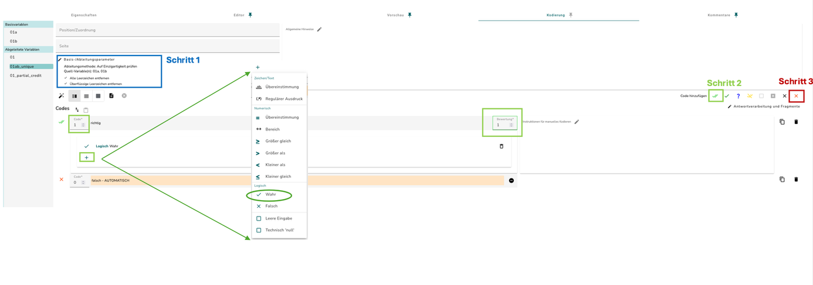{width="6.3in" height="2.213888888888889in"}

Hier wird die SuS-Response auf Einzigartigkeit geprüft. Full Credit erhalten SuS nur, wenn zwei unterschiedliche, korrekte Werte eingetragen werden.

**Schritt 1:** Bei *Basis-/ Ableitungsparameter* auswählen: Ableitungsmethode: Auf Einzigartigkeit prüfen + Quell-Variablen: 01a, 01b auswählen. Außerdem „Alle Leerzeichen entfernen" + „Überflüssige Leerzeichen entfernen" auswählen.

**Schritt 2:** Richtig-Code (Zwei Grüne Haken) auswählen. Code 1 nennen. Bei *Regel ändern* „Logisch Wahr" auswählen. Oben rechts Bewertung = 1 auswählen.

**Schritt 3:** Rotes Kreuz „falsch-AUTOMATISCH" auswählen.

**Geschlossene Kodierung für Abgeleitete Variable 11_partial_credit**

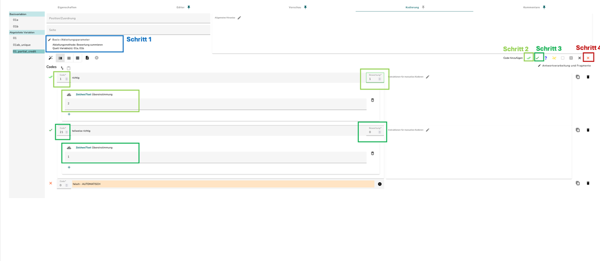{width="6.3in" height="2.7430555555555554in"}

Diese Abgeleitete Variable hilft der finalen abgeleiteten Variable 01 zu definieren, dass bei nur einer korrekten Antwort oder zweimal der gleichen Antwort, 1 Credit vergeben wird.

**Schritt 1:** Ableitungsmethode: Bewertung summieren auswählen. Quellvariablen 01a und 01b auswählen.

**Schritt 2:** Richtig-Code (Doppelter grüner Haken) auswählen. Code 1 nennen. *Zeichen/Text Übereinstimmung* = 2 auswählen. Oben recht Bewertung = 1 auswählen.

**Schritt 3:** Teilweise-Richtig-Code (ein grüner Haken) auswählen. Code 21 nennen. *Zeichen/Text Übereinstimmung* = 1 auswählen. Oben recht Bewertung = 0 auswählen.

**Schritt 4:** Rotes Kreuz „falsch-AUTOMATISCH" auswählen.

**Geschlossene Kodierung für Abgeleitete Variable 01**

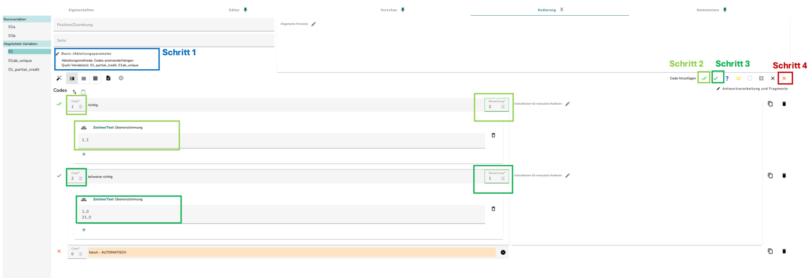{width="6.3in" height="2.1729166666666666in"}

Hier werden alle abgeleiteten Variablen nochmal abgeleitet, um die finale Punktevergabe festzulegen.

**Schritt 1:** Ableitungsmethode: Codes aneinanderhängen auswählen. Quellvariablen 0 1_partial_credit, 01ab_unique auswählen.

**Schritt 2:** Richtig-Code (Doppelter grüner Haken) auswählen. Code 1 nennen. *Zeichen/Text Übereinstimmung* „1_1" eintragen. (Wenn SuS bei PC-Variable den Richtig-Code hat und bei Unique-Variable den Richtig-Code hat, erhält SuS 2 Full Credits). Oben recht Bewertung = 2 auswählen.

- *Code 1:* 2 von 2 Antworten korrekt (2 Credits)

**Schritt 3:** Teilweise-Richtig-Code (Ein grüner Haken) auswählen. Code 21 nennen. *Zeichen/Text Übereinstimmung* „1_0", „21_1" nennen. (Wenn SuS nur eine korrekte Antwort hat oder zweimal dieselbe korrekte Antwort, erhält SuS 1 Credit). Oben rechts Bewertung = 1 auswählen.

- *Code 2:* 1 von 2 Antworten korrekt (1 Credits)

**Schritt 4:** Rotes Kreuz „falsch-AUTOMATISCH" auswählen.

# **2. Mathe Primar (MaP)**

## **2.1. Langantwort**

**Beispielaufgabe:** MaP Langantwort Dummy

**IQB-Studio-Link:** <https://iqb-studio.de/#/a/1329/149909/schemer>

**Itemformat:** Langantwort mit 1 Eingabefeld

**Partial Credit Prinzip:** inhaltlich 0-1

**Bewertung:** 0-1-2 (2 Credits bei korrekter Antwort, 1 Credit bei teilweise korrekter Antwort)

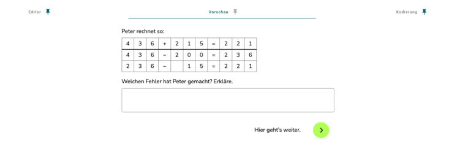{width="6.3in" height="1.5375in"}

**(Manuelle) Kodierung der Basisvariable 01** 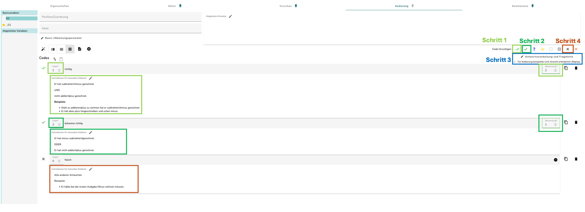{width="6.3in" height="2.2979166666666666in"}

**Schritt 1:** Richtig-Code (Doppelter grüner Haken) auswählen. Code 1 nennen. Bei *Instruktionen für manuelles Kodieren* passende Kodieranweisung eintragen. Bewertung = 2 auswählen.

**Schritt 2:** Teilweise-Richtig-Code (Ein grüner Haken) auswählen. Code 2 nennen. Bei *Instruktionen für manuelles Kodieren* passende Kodieranweisung eintragen. Bewertung = 1 auswählen.

**Schritt 3:** Bei *Antwortverarbeitung und* *Fragment* „Für Kodierung komplette Unit-Ansicht erforderlich (Replay)" auswählen.

**Schritt 4:** Schwarzes Kreuz („falsch") auswählen. Bei *Instruktionen für manuelles Kodieren* passende Kodieranweisung eintragen.

## **2.2. MC und Langantwort**

**Beispielaufgabe:** PC Dummy „MC_und_Langantwort"

**IQB-Studio-Link:** <https://iqb-studio.de/#/a/1329/149322/schemer>

**Itemformat:** 1 MC mit 1 Langantwort-Eingabefeld

**Partial Credit Prinzip:** inhaltlich 0-1

**Bewertung:** 0-1-2 (Bei korrekter MC-Auswahl UND korrekter Langantwort erhält SuS 2 Credits, bei korrekter MC-Auswahl UND teilweise-korrekter Langantwort erhält SuS 1 Credit. Bei falscher MC-Auswahl = No Credit. Bei korrekter MC-Auswahl UND falscher Langantwort = No Credit)

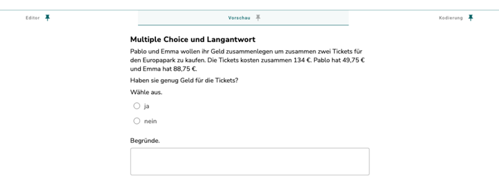{width="6.3in" height="1.4125in"}

**Geschlossene Kodierung der Basisvariablen 01a**

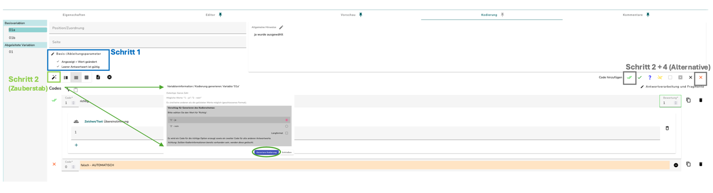{width="6.3in" height="1.7083333333333333in"}

**Schritt 1:** *Basis-/Ableitungsparameter* anpassen (Häkchen bei "angezeigt = Wert geändert" und "leerer Antwortwert ist gültig")

**Schritt 2:** Mit Zauberstab die richtige Antwortoption (1 = „stimmt", 2 = „stimmt nicht") auswählen (s. Allgemeine Hinweise für Kodieranweisung). Rotes Kreuz (Falsch -- automatisch) wird mit Zauberstab automatisch hinzugefügt.

**Alternative Kodierung ohne Zauberstab:**

**Schritt 2:** Richtig-Code (Doppelter grüner Haken) auswählen. Code 1 nennen. Bei *Zeichen/ Text Übereinstimmung* Wert 1 (für „ja"; s. Kodieranweisung) eintragen. Bewertung = 1 auswählen.

**Schritt 3:** Rotes Kreuz „falsch-AUTOMATISCH" auswählen.

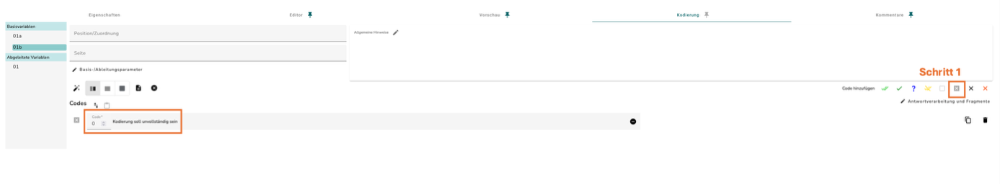{width="6.3in" height="1.1645833333333333in"}

**(Manuelle) Kodierung der Basisvariable 01b**

**Schritt 1:** Als Falsch-Code „Kodierung soll unvollständig sein" auswählen.

**Geschlossene Kodierung der Abgeleiteten Variable 01**

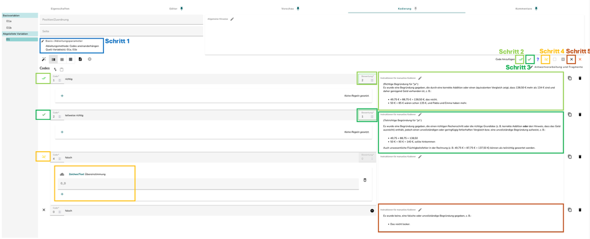{width="6.3in" height="2.5527777777777776in"}

**Schritt 1:** Bei *Basis-/Ableitungsparameter* Ableitungsmethode: Codes aneinanderhängen auswählen + Quellvariablen 01a, 01b auswählen

**Schritt 2:** Richtig-Code (Doppelter grüner Haken) auswählen. Code 1 benennen. Keinen Regelsatz hinzufügen. Bewertung = 2 auswählen. Kodieranweisung für richtige Antwort bei *Instruktion für manuelles Kodieren* eintragen.

- *Code 1: MC UND Langantwort korrekt (2 Credits)*

**Schritt 3:** Teilweise-Richtig-Code (Ein grüner Haken) hinzufügen. Code 2 benennen. Keinen Regelsatz hinzufügen. Bewertung = 1 auswählen. Kodieranweisung für teilrichtige Antwort bei *Instruktion für manuelles Kodieren* eintragen.

- Code 2: MC korrekt UND Langantwort teilweise korrekt (1 Credits)

**Schritt 4:** Gelbe doppelte Haken „Falsch-Code" auswählen. Bei *Zeichen/ Text Übereinstimmung* „0_0" eintragen. Bewertung = 0 auswählen.

**Schritt 5:** Schwarzes Kreuz „Falsch: Alle anderen Antworten" auswählen. Kodieranweisung für falsche Antwort *Zeichen/ Text Übereinstimmung* eintragen.

## **2.3. Numerische Kurzantwort**

**Anmerkung:** mind. 3 Eingabefelder (z.B. Rechenpäckchen)

**Beispielaufgabe:** PC Dummy „Rechenaufgabe"

**IQB-Studio-Link:** <https://iqb-studio.de/#/a/1329/149224/preview>

**Itemformat:** Rechenpäckchen mit 3 Eingabefeldern

**Partial Credit Prinzip:** elementweise 0-1-2-3 (hier für 3 Eingabefelder)

**Bewertung:** 0-0-1-2 (Full Credit für Summenscore -1. Wenn alle 3 Antworten korrekt, erhält SuS 2 Credits. Wenn 2 von 3 korrekt, erhält SuS 1 Credit. Wenn 0 von 3 korrekt, erhält SuS 0 Credits.)

{width="6.3in" height="0.8875in"}

**Geschlossene Kodierung der Basisvariable 01a,01b, 01c**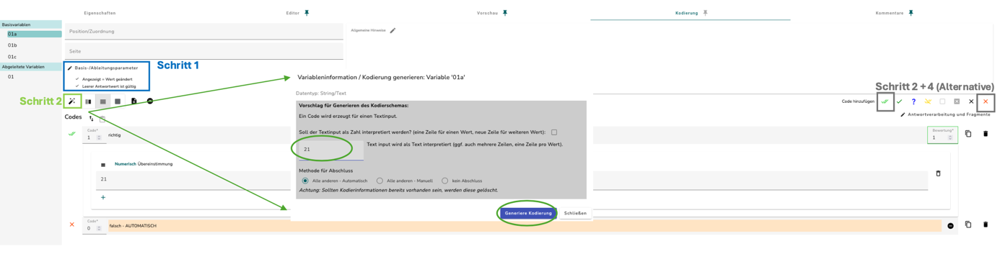{width="6.3in" height="1.6027777777777779in"}

**Schritt 1:** *Basis-/Ableitungsparameter* anpassen (Häkchen bei "angezeigt = Wert geändert" und "leerer Antwortwert ist gültig").

**Schritt 2:** Mit Zauberstab die Lösungszahl eintragen (Hier „21") (s. Allgemeine Hinweise für Kodieranweisung). Rotes Kreuz (Falsch -- automatisch) wird mit Zauberstab automatisch hinzugefügt.

**Alternative Kodierung ohne Zauberstab:**

**Schritt 2:** Richtig-Code (Doppelter grüner Haken) auswählen. Code 1 benennen. Bei *Numerische Übereinstimmung* die Lösungszahl (s. Kodieranweisung) eintragen. Bewertung = 1 auswählen.

**Schritt 3:** Rotes Kreuz „falsch-AUTOMATISCH" auswählen.

Diese Schritte bei allen drei Basisvariablen 01a, 01b, 01c wiederholen.

**Achtung!** Liegt die Lösungszahl im **vierstelligen Bereich** (oder mehr), muss ein zweiter Richtig-Code (Code 11 und Code 12) angelegt werden, um unterschiedliche Schreibweisen mithilfe eines regulären Ausdrucks abzudecken. Dies ist beispielsweise bei der Basisvariable 01c der Fall.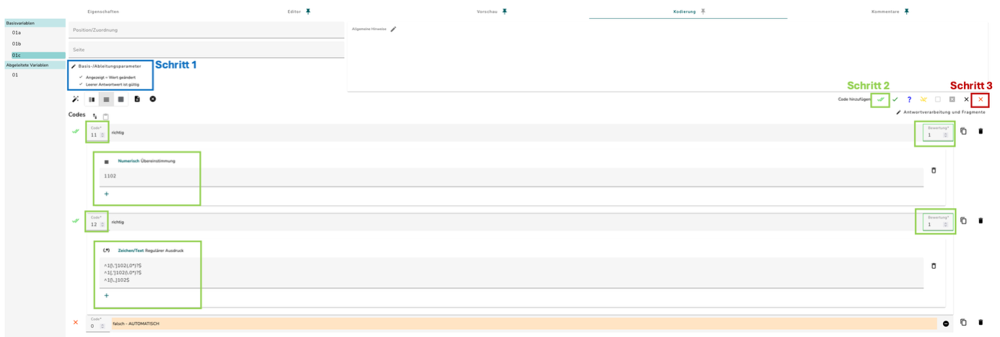{width="6.3in" height="0.8527777777777777in"}

**Geschlossene Kodierung der abgeleiteten Variable 01**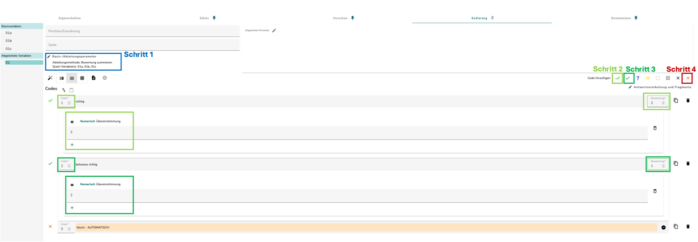{width="6.3in" height="2.192361111111111in"}

**Schritt 1:** Bei *Basis-/Ableitungsparameter* Ableitungsmethode: Bewertung summieren auswählen + Quellvariablen 01a, 01b, 01c auswählen

**Schritt 2:** Richtig-Code (Doppelter grüner Haken) auswählen. Code 1 benennen. *Numerische Übereinstimmung* eintragen mit maximal zu erreichenden richtigen Antworten (Summenscore = Anzahl der Basisvariablen). Bewertung Summenscore -1 auswählen (hier = 2).

- *Code 1:* 3 von 3 Antworten korrekt (2 Credits)

**Schritt 3:** Teilweise-Richtig-Code (Ein grüner Haken) hinzufügen. Code 2 benennen. *Numerische Übereinstimmung* (maximale Anzahl korrekter Antworten -- 1, hier = 2) eintragen. Bewertung auf Summenscore -2 auswählen (Hier = 1).

- *Code 2:* 2 von 3 Antworten korrekt (1 Credits)

**Schritt 4:** Rotes Kreuz „falsch-AUTOMATISCH" auswählen.

## **2.4. Complex Multiple Choice**

**Anmerkung:** Aufgabengruppe "Standardrepräsentanten"

**Beispielaufgabe:** PC Dummy „CMC_4x2"

**IQB-Studio-Link:** <https://iqb-studio.de/#/a/1329/149219/preview>

**Itemformat:** CMC mit 4 Zeilen x 2 Auswahloptionen

**Partial Credit Prinzip:** elementweise 0-1-2-3-4

**Bewertung:** 0-0-0-1-2 (Full Credit = 2 Punkte, Partial Credit = 1 Punkt. Wenn alle vier Zeilen korrekt sind, erhält SuS 2 Credits, wenn 3 von 4 Zeilen korrekt sind, erhält SuS 1 Credit, wenn 0 bis 2 Zeilen korrekt, erhält SuS 0 Credits.)

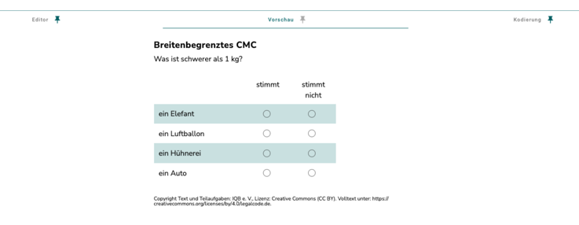{width="6.3in" height="1.7409722222222221in"}

**Geschlossene Kodierung der Basisvariablen 01a, 01b, 01c, 01d**

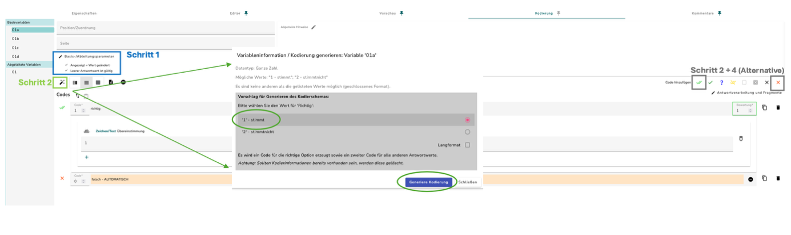{width="6.3in" height="1.8833333333333333in"}

**Schritt 1:** *Basis-/Ableitungsparameter* anpassen (Häkchen bei "angezeigt = Wert geändert" und "leerer Antwortwert ist gültig").

**Schritt 2:** Mit Zauberstab die richtig Antwortoption (1 = „stimmt", 2 = „stimmt nicht") auswählen (s. Allgemeine Hinweise für Kodieranweisung). Rotes Kreuz (Falsch -- automatisch) wird mit Zauberstab automatisch hinzugefügt.

**Alternative Kodierung ohne Zauberstab**

**Schritt 2:** Richtig-Code (Doppelter grüner Haken) auswählen. Code 1 benennen. *Zeichen/Text Übereinstimmung* auswählen und 1 = stimmt/ 2 = stimmt nicht eintragen (s. Allgemeine Hinweise).

**Schritt 3:** Rotes Kreuz „falsch-AUTOMATISCH" auswählen.

Diese Schritte bei allen vier Basisvariablen wiederholen.

**Geschlossene Kodierung der abgeleiteten Variablen 01**

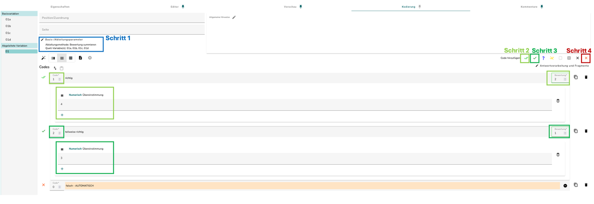{width="6.3in" height="2.1694444444444443in"}

**Schritt 1**: *Basis-/Ableitungsparameter* auswählen: Ableitungsmethode: Bewertung summieren + Quell-Variablen auswählen: 01a, 01b, 01c, 01d

**Schritt 2:** Richtig-Code (Doppelter grüner Haken) auswählen. Code 1 nennen. Bei *Numerische Übereinstimmung* die maximale Anzahl an korrekten Antworten eintragen (hier Summenscore = 4). Bei Bewertung = 2 auswählen.

- *Code 1:* 4 von 4 Antworten korrekt (2 Credits)

**Schritt 3:** Teilweise-Richtig-Code (Ein grüner Haken) auswählen. Code 2 nennen. Bei *Numerische* Übereinstimmmung Summenscore -1 eintragen (hier = 3). Oben rechts Bewertung auf Maximale Bewertung -1 setzen (Hier = 1).

- *Code 2:* 3 von 4 Antworten korrekt (1 Credit)

**Schritt 4:** Rotes Kreuz „falsch-AUTOMATISCH" auswählen.

## **2.5. Zuordnen (Variante 1)**

**Anmerkung:** Unendlich viele Elemente (Einstellung „Elemente kopieren") x 4 Ablegeliste (mind. 1 Element bleibt übrig

**Beispielaufgabe:** PC Dummy „MaP_DnD_V1"

**IQB-Studio-Link:** <https://iqb-studio.de/#/a/1329/149338/preview>

**Itemformat:** Zuordnen mit 3 Elementen x 4 Ablegelisten

**Partial Credit Prinzip:** elementweise 0-1-2-3-4

**Bewertung:** 0-0-0-1-2 (Full Credit = 2 Punkte, Partial Credit = 1 Punkt. Wenn alle vier Zeilen korrekt sind, erhält SuS 2 Credits, wenn 3 von 4 Zeilen korrekt sind, erhält SuS 1 Credit, wenn 0 bis 2 Zeilen korrekt, erhält SuS 0 Credits.)

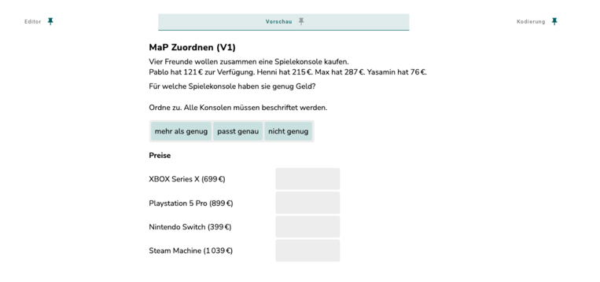{width="6.3in" height="1.8923611111111112in"}

**Besonderheit dieses Formats**: Anzahl der Elemente in den Ausgangslisten ist größer ist als die Anzahl der Ablegelisten. Nach der Zuordnung = mind. 1 Element bleibt übrig. Das muss nicht zwingend mit der Einstellung „Elemente kopieren" erfolgen, sondern kann auch über mehrere **„einmal verwendbare** Elemente" gehen.

**Geschlossene Kodierung der Basisvariablen 01a, 01b, 01c, 01d** 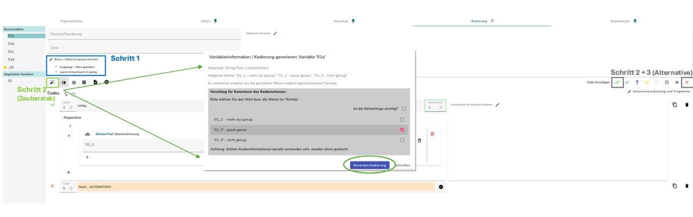{width="6.3in" height="1.9777777777777779in"}

**Schritt 1:** *Basis-/Ableitungsparameter* anpassen (Häkchen bei "angezeigt = Wert geändert" und "leerer Antwortwert ist gültig").

**Schritt 2:** Mit dem Zauberstab das passende Zuordnungs-Element auswählen (s. Kodieranweisung; hier: „01_2"). Rotes Kreuz (Falsch -- automatisch) wird mit Zauberstab automatisch hinzugefügt.

Diese Schritte für alle Basisvariablen 01a, 01b, 01c, 01d wiederholen.

**Alternative Kodierung ohne Zauberstab**

**Schritt 2:** Richtig-Code (Doppelter grüner Haken) auswählen. Code 1 nennen. Bei *Zeichen/Text Übereinstimmung* das passende Zuordnungs-Element auswählen (s. Kodieranzweisung). Bei Bewertung = 1 auswählen.

**Schritt 3:** Rotes Kreuz „falsch-AUTOMATISCH" auswählen.

Diesen Schritt für alle Basisvariablen 01a, 01b, 01c, 01d wiederholen.

**Geschlossene Kodierung der abgeleiteten Variable 01**

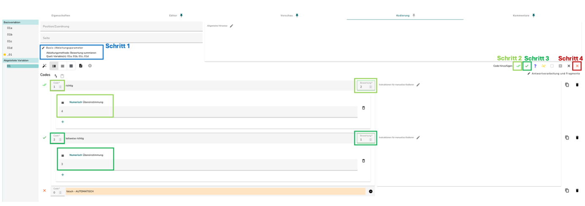{width="6.3in" height="2.2194444444444446in"}

**Schritt 1**: Basis-/Ableitungsparameter auswählen: Ableitungsmethode: Bewertung summieren + Quell-Variablen auswählen: 01a, 01b, 01c, 01d

**Schritt 2:** Richtig-Code (Doppelter grüner Haken) auswählen. Code 1 nennen. Bei *Numerische Übereinstimmung* die maximale Anzahl an korrekten Antworten eintragen (hier Summenscore = 4). Bei Bewertung = 2 auswählen.

- *Code 1:* 4 von 4 Antworten korrekt (2 Credits)

**Schritt 3:** Teilweise-Richtig-Code (Ein grüner Haken) auswählen. Code 2 nennen. Bei *Numerische* Übereinstimmmung Summenscore -1 eintragen (hier = 3). Oben rechts Bewertung auf Maximale Bewertung -1 setzen (Hier = 1).

- *Code 2:* 3 von 4 Antworten korrekt (1 Credits)

**Schritt 4:** Rotes Kreuz „falsch-AUTOMATISCH" auswählen.

## **2.6. Zuordnen (Variante 2)**

**Anmerkung:** Unendlich viele Elemente (Einstellung „Elemente kopieren") x 9 Ablegeliste (mind. 1 Element bleibt übrig; Zuordnungskombinationen, Reihenfolge der Elemente UND zeilenweise Einzigartigkeit relevant

**Beispielaufgabe:** PC Dummy „MaP_Zuordnen V2"

**IQB-Studio-Link:** <https://iqb-studio.de/#/a/1329/149938/preview>

**Itemformat:** Zuordnen mit unendlich vielen Elementen x 9 Ablegelisten mit Zuordnungskombinationen, Reihenfolge der Elemente UND zeilenweise Einzigartigkeit relevant

**Partial Credit Prinzip:** zeilenweise 0-1-2-3

**Bewertung:** 0-0-1-2 (Full Credit = 2 Punkte, Partial Credit = 1 Punkt. Wenn alle 3 Zeilen korrekt sind, erhält SuS 2 Credits, wenn 2 von 3 Zeilen korrekt sind, erhält SuS 1 Credit, wenn 0 oder 1 Antwort korrekt, erhält SuS 0 Credits)

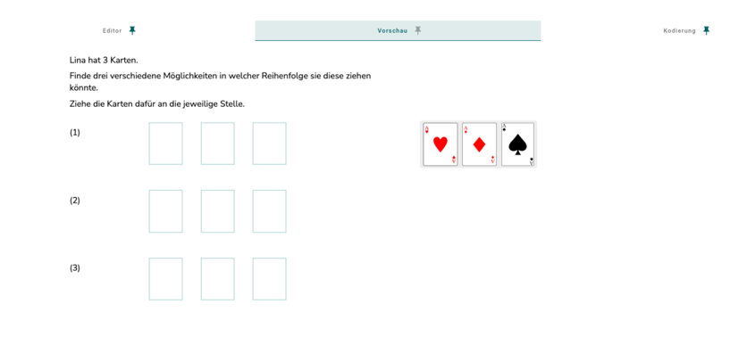{width="6.3in" height="1.71875in"}

**Geschlossene Kodierung der Basisvariable 01a_1, 01a_2, 01a_3, 01b_1, 01b_2, 01b_3, 01c_1, 01c_2, 01c_3**

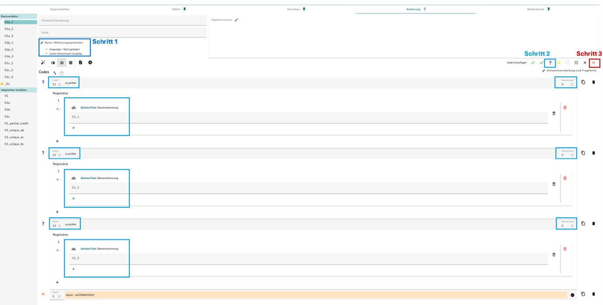{width="6.3in" height="3.1729166666666666in"}

**Schritt 1:** *Basis-/Ableitungsparameter* anpassen (Häkchen bei "angezeigt = Wert geändert" und "leerer Antwortwert ist gültig").

**Schritt 2:** 3x zu-Prüfen-Code (Blaues Fragezeichen) auswählen. Code 31, Code 32, Code 33 nennen. Bei *Zeichen/Text Übereinstimmung* Zuordnungs-Element auswählen (s. Kodieranweisung). Bei Bewertung = 0 auswählen.

Jedes Zuordnungs-Element erhält einen zu-prüfen-Code, welcher in der abgeleiteten Variable auf die Reihenfolge und Einzigartigkeit geprüft wird.

**Schritt 4:** Rotes Kreuz „falsch-AUTOMATISCH" auswählen.

Diese Schritte für alle Basisvariablen wiederholen.

**Geschlossene Kodierung der abgeleiteten Variable 01_unique_ab, 01_unique_ac, 01_unique_bc**

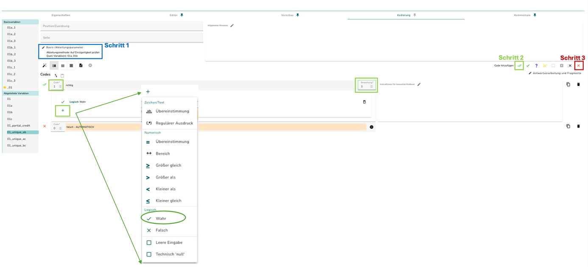

In dieser abgeleiteten Variable wird geprüft, dass sich keine der Kombinationen wiederholen.

**Schritt 1:** Bei *Basis-/Ableitungsparameter* die Ableitungsmethode : „Auf Einzigartigkeit prüfen" auswählen. Quell-Variablen: 01a, 01b auswählen (bzw. 01a, 01c ODER 01b, 01c)

**Schritt 2:** Richtig-Code (doppelter grüner Haken) auswählen. Code 1 nennen. Bei dem Plus-Zeichen als Regel „Logisch Wahr" auswählen. Bewertung = 1 auswählen.

**Schritt 3:** Rotes Kreuz „falsch-AUTOMATISCH" auswählen.

Diese Schritte wiederholen für 01_unique_ab, 01_unique_ac, 01_unique_bc

**Geschlossene Kodierung der abgeleiteten Variable 01_partial_credit**

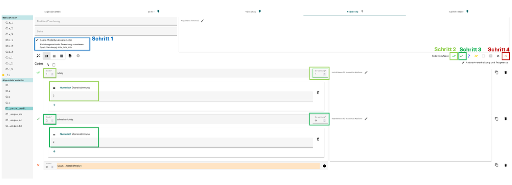{width="6.3in" height="2.28125in"}

**Schritt 1:** Bei *Basis-/Ableitungsparameter* die Ableitungsmethode : „Bewertung summieren" auswählen. Quell-Variablen: 01a, 01b, 01c auswählen

**Schritt 2:** Richtig-Code (doppelter grüner Haken) auswählen. Code 1 nennen. Bei *Numerische Übereinstimmung* = 3 eintragen. Bewertung = 1 auswählen.

**Schritt 3:** Teilweise-Richtig-Code (ein grüner Haken) auswählen. Code 2 nennen. Bei *Numerische Übereinstimmung* = 2 eintragen. Bewertung = 0 auswählen.

**Schritt 4:** Rotes Kreuz „falsch-AUTOMATISCH" auswählen.

**Geschlossene Kodierung der abgeleiteten Variable 01a, 01b, 01c**

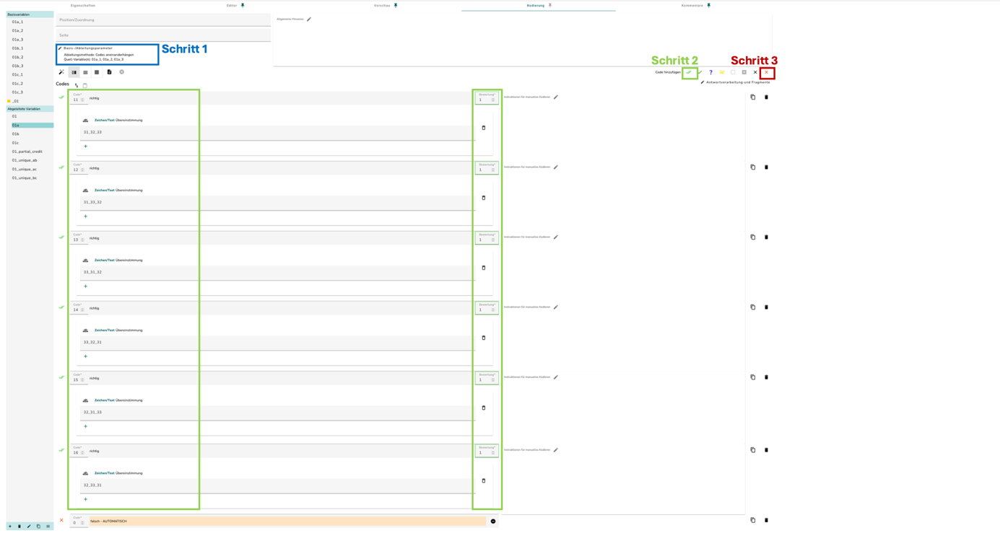{width="6.3in" height="3.377083333333333in"}

**Schritt 1:** Bei *Basis-/Ableitungsparameter* die Ableitungsmethode : „Codes aneinanderhängen" auswählen. Quell-Variablen: 01a_1, 01a_2, 01a_3 auswählen (bzw. alle Basisvariablen von 01b oder 01c)

**Schritt 2:** 6x Richtig-Code (doppelter grüner Haken) auswählen. Code 11 bis 16 nennen. Bei *Zeichen/Text Übereinstimmung* alle möglichen Kombinationen der zu-Prüfen-Code aus den Basisvariablen als aneinander gehängte Codes eintragen (31_32_33, 31_33_32 etc.). Bewertung = 1 auswählen.

**Schritt 3:** Rotes Kreuz „falsch-AUTOMATISCH" auswählen.

**Geschlossene Kodierung der abgeleiteten Variable 01**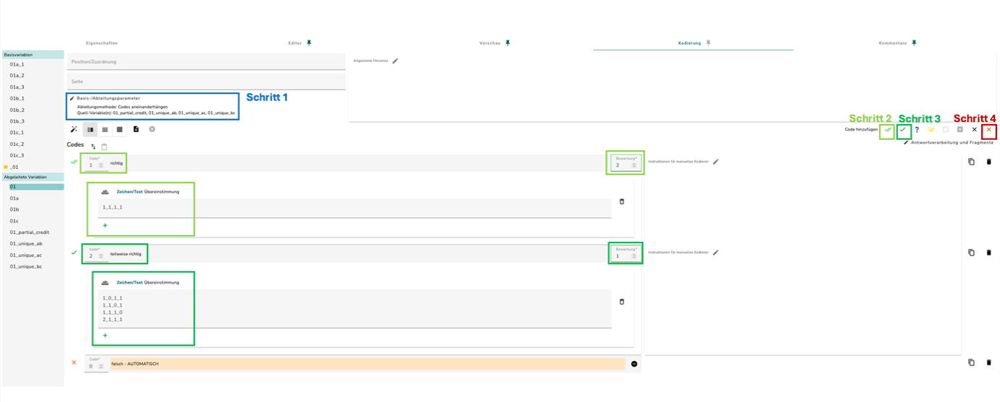{width="6.3in" height="2.532638888888889in"}

**Schritt 1:** Bei *Basis-/Ableitungsparameter* die Ableitungsmethode : „Codes aneinanderhängen" auswählen. Quell-Variablen: 01_partial_credit, 01_unique_ab, 01_unique_ac, 01_unique_bc auswählen.

**Schritt 2:** Richtig-Code (doppelter grüner Haken) auswählen. Code 1 nennen. Bei *Zeichen/Text Übereinstimmung* die aneinander gehängten Codes eintragen (1_1_1_1). Bewertung = 2 auswählen. (Wenn alle 3 Zeilen korrekt zugeordnet wurden und sich nicht wiederholen, erhält SuS 2 Credits).

- *Code 1:* 3 von 3 Antworten korrekt (2 Credits)

**Schritt 3:** Teilweise-Richtig-Code (ein grüner Haken) auswählen. Code 2 nennen. Bei *Zeichen/Text Übereinstimmung* die aneinander gehängten Codes eintragen (1_0_1_1 etc.). Bewertung = 1 auswählen. (Wenn nur 2 Zeilen korrekt oder sich 1 Kombination doppelt, erhählt SuS 1 Credit).

- *Code 2:* 2 von 3 Antworten korrekt (1 Credit)

**Schritt 4:** Rotes Kreuz „falsch-AUTOMATISCH" auswählen.
